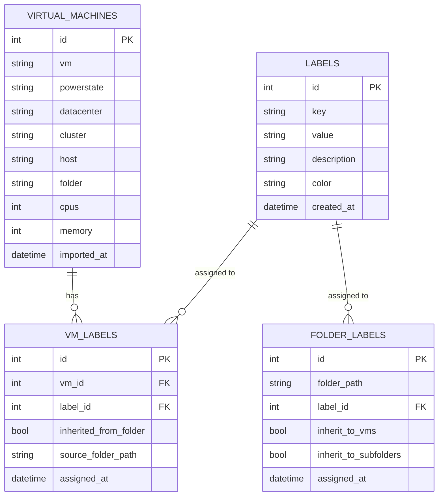

# Data Model

This document describes the database schema and data model used by the VMware Inventory OPA application.

## Overview

The application uses SQLAlchemy ORM with support for multiple database backends (SQLite, PostgreSQL, MySQL). The schema consists of four main tables:

- **virtual_machines**: Core VM inventory data
- **labels**: Label definitions (key-value pairs)
- **vm_labels**: VM-to-Label assignments
- **folder_labels**: Folder-to-Label assignments

## Entity Relationship Diagram



## Table Schemas

### virtual_machines

The main table storing VMware virtual machine inventory data.

#### Basic Information
| Column | Type | Index | Description |
|--------|------|-------|-------------|
| `id` | INTEGER | PK | Primary key |
| `vm` | VARCHAR(255) | ✓ | VM name |
| `powerstate` | VARCHAR(50) | ✓ | Power state (poweredOn, poweredOff, suspended) |
| `template` | BOOLEAN | ✓ | Whether VM is a template |
| `dns_name` | VARCHAR(255) | | DNS hostname |
| `connection_state` | VARCHAR(50) | | Connection state |
| `guest_state` | VARCHAR(50) | | Guest OS state |
| `heartbeat` | VARCHAR(50) | | VMware Tools heartbeat status |

#### Power and Timing
| Column | Type | Index | Description |
|--------|------|-------|-------------|
| `poweron` | DATETIME | | Last power-on time |
| `suspend_time` | DATETIME | | Last suspend time |
| `creation_date` | DATETIME | ✓ | VM creation date |
| `change_version` | VARCHAR(50) | | Configuration change version |

#### Resources
| Column | Type | Description |
|--------|------|-------------|
| `cpus` | INTEGER | Number of virtual CPUs |
| `memory` | INTEGER | Memory in MiB |
| `nics` | INTEGER | Number of network adapters |
| `disks` | INTEGER | Number of virtual disks |

#### Network
| Column | Type | Description |
|--------|------|-------------|
| `primary_ip_address` | VARCHAR(50) | Primary IP address |
| `network_1` to `network_8` | VARCHAR(255) | Network adapter assignments |

#### Storage
| Column | Type | Description |
|--------|------|-------------|
| `provisioned_mib` | FLOAT | Provisioned storage in MiB |
| `in_use_mib` | FLOAT | Storage in use in MiB |
| `unshared_mib` | FLOAT | Unshared storage in MiB |

#### Infrastructure
| Column | Type | Index | Description |
|--------|------|-------|-------------|
| `datacenter` | VARCHAR(255) | ✓ | Datacenter name |
| `cluster` | VARCHAR(255) | ✓ | Cluster name |
| `host` | VARCHAR(255) | ✓ | ESXi host name |
| `folder` | VARCHAR(500) | ✓ | Folder path |
| `resource_pool` | VARCHAR(255) | ✓ | Resource pool name |
| `vapp` | VARCHAR(255) | | vApp name |

#### Operating System
| Column | Type | Index | Description |
|--------|------|-------|-------------|
| `os_config` | VARCHAR(255) | ✓ | OS configuration/type |
| `os_vmware_tools` | VARCHAR(255) | | VMware Tools version |

#### Hardware
| Column | Type | Description |
|--------|------|-------------|
| `firmware` | VARCHAR(50) | Firmware type (BIOS/EFI) |
| `hw_version` | VARCHAR(50) | Virtual hardware version |
| `hw_upgrade_status` | VARCHAR(50) | Hardware upgrade status |
| `hw_upgrade_policy` | VARCHAR(50) | Upgrade policy |
| `num_monitors` | INTEGER | Number of monitors |
| `video_ram_kib` | INTEGER | Video RAM in KiB |

#### HA/FT Configuration
| Column | Type | Description |
|--------|------|-------------|
| `das_protection` | VARCHAR(50) | vSphere HA protection status |
| `ft_state` | VARCHAR(50) | Fault Tolerance state |
| `ft_latency` | FLOAT | FT latency |
| `ha_restart_priority` | VARCHAR(50) | HA restart priority |
| `ha_isolation_response` | VARCHAR(50) | HA isolation response |
| `ha_vm_monitoring` | VARCHAR(50) | HA VM monitoring status |
| `cluster_rules` | TEXT | DRS/affinity rules |

#### Boot Configuration
| Column | Type | Description |
|--------|------|-------------|
| `boot_required` | BOOLEAN | Boot required flag |
| `boot_delay` | INTEGER | Boot delay in milliseconds |
| `boot_retry_enabled` | BOOLEAN | Boot retry enabled |
| `boot_bios_setup` | BOOLEAN | Enter BIOS setup on boot |

#### Identifiers
| Column | Type | Index | Description |
|--------|------|-------|-------------|
| `vm_id` | VARCHAR(50) | ✓ | VMware internal VM ID |
| `vm_uuid` | VARCHAR(100) | ✓ (Unique) | VM UUID |

#### Custom Fields
| Column | Type | Index | Description |
|--------|------|-------|-------------|
| `code_ccx` | VARCHAR(100) | | Custom field: CCX code |
| `vm_nbu` | VARCHAR(100) | | Custom field: NetBackup |
| `vm_orchid` | VARCHAR(100) | | Custom field: Orchid |
| `licence_enforcement` | VARCHAR(50) | | License enforcement |
| `env` | VARCHAR(50) | ✓ | Environment (prod, dev, test, etc.) |

#### Metadata
| Column | Type | Description |
|--------|------|-------------|
| `imported_at` | DATETIME | Timestamp when record was imported |
| `annotation` | TEXT | VM annotations/notes |

### labels

Defines available labels (key-value pairs with optional metadata).

| Column | Type | Index | Description |
|--------|------|-------|-------------|
| `id` | INTEGER | PK | Primary key |
| `key` | VARCHAR(100) | ✓ | Label key (e.g., "environment", "owner", "project") |
| `value` | VARCHAR(255) | ✓ | Label value (e.g., "production", "john.doe", "web-app") |
| `description` | VARCHAR(500) | | Optional description |
| `color` | VARCHAR(7) | | Hex color code for UI display (#RRGGBB) |
| `created_at` | DATETIME | | Creation timestamp |
| `updated_at` | DATETIME | | Last update timestamp |

**Constraints:**
- UNIQUE constraint on (`key`, `value`) - prevents duplicate label definitions

**Example Labels:**
```sql
INSERT INTO labels (key, value, description, color) VALUES
  ('environment', 'production', 'Production workloads', '#dc3545'),
  ('environment', 'staging', 'Staging/pre-prod', '#ffc107'),
  ('environment', 'development', 'Development/test', '#28a745'),
  ('owner', 'platform-team', 'Platform team workloads', '#007bff'),
  ('compliance', 'pci-dss', 'PCI-DSS compliance required', '#6c757d');
```

### vm_labels

Many-to-many relationship between VMs and labels, with support for inherited labels.

| Column | Type | Index | Description |
|--------|------|-------|-------------|
| `id` | INTEGER | PK | Primary key |
| `vm_id` | INTEGER | ✓ FK | Foreign key to virtual_machines.id |
| `label_id` | INTEGER | ✓ FK | Foreign key to labels.id |
| `assigned_at` | DATETIME | | Assignment timestamp |
| `assigned_by` | VARCHAR(100) | | User who assigned the label |
| `inherited_from_folder` | BOOLEAN | ✓ | Whether label is inherited from folder |
| `source_folder_path` | VARCHAR(500) | | Source folder path if inherited |

**Constraints:**
- UNIQUE constraint on (`vm_id`, `label_id`) - prevents duplicate assignments
- CASCADE delete on both foreign keys

**Label Inheritance:**
- Labels can be assigned directly to VMs
- Labels can also be inherited from folder assignments
- `inherited_from_folder` = `true` indicates the label came from a folder
- `source_folder_path` tracks which folder the label came from

### folder_labels

Assigns labels to folder paths with inheritance configuration.

| Column | Type | Index | Description |
|--------|------|-------|-------------|
| `id` | INTEGER | PK | Primary key |
| `folder_path` | VARCHAR(500) | ✓ | Folder path (e.g., "/datacenter1/vm/production") |
| `label_id` | INTEGER | ✓ FK | Foreign key to labels.id |
| `assigned_at` | DATETIME | | Assignment timestamp |
| `assigned_by` | VARCHAR(100) | | User who assigned the label |
| `inherit_to_vms` | BOOLEAN | | Whether to apply label to VMs in folder |
| `inherit_to_subfolders` | BOOLEAN | | Whether to apply to subfolders recursively |

**Constraints:**
- UNIQUE constraint on (`folder_path`, `label_id`) - prevents duplicate assignments
- CASCADE delete on label_id foreign key

**Inheritance Behavior:**
- When `inherit_to_vms` = `true`, label is applied to all VMs in the folder
- When `inherit_to_subfolders` = `true`, label is applied recursively to all subfolders
- Changes to folder labels can be synced to VMs using the sync operation

## Indexes

The following columns are indexed for query performance:

### virtual_machines
- `vm` - Frequent searches by VM name
- `powerstate` - Common filter (powered on/off)
- `template` - Common filter (exclude templates)
- `datacenter` - Frequently grouped/filtered
- `cluster` - Frequently grouped/filtered
- `host` - Frequently grouped/filtered
- `folder` - Frequently grouped/filtered
- `resource_pool` - Frequently grouped
- `os_config` - Frequently grouped
- `env` - Common filter
- `creation_date` - Used in date range queries
- `vm_id` - Lookup by VMware ID
- `vm_uuid` - UNIQUE index for UUID lookups

### labels
- `key` - Filter labels by key
- `value` - Filter labels by value
- UNIQUE (`key`, `value`) - Prevent duplicates

### vm_labels
- `vm_id` - Lookup labels for a VM
- `label_id` - Lookup VMs with a label
- `inherited_from_folder` - Filter direct vs inherited
- UNIQUE (`vm_id`, `label_id`) - Prevent duplicates

### folder_labels
- `folder_path` - Lookup labels for a folder
- `label_id` - Lookup folders with a label
- UNIQUE (`folder_path`, `label_id`) - Prevent duplicates

## Query Examples

### Get all VMs in a cluster with their labels
```python
from sqlalchemy.orm import sessionmaker
from src.models import VirtualMachine, VMLabel, Label

vms = session.query(VirtualMachine, Label).join(
    VMLabel, VirtualMachine.id == VMLabel.vm_id
).join(
    Label, VMLabel.label_id == Label.id
).filter(
    VirtualMachine.cluster == 'cluster-01'
).all()
```

### Get VMs with a specific label
```python
vms = session.query(VirtualMachine).join(
    VMLabel, VirtualMachine.id == VMLabel.vm_id
).join(
    Label, VMLabel.label_id == Label.id
).filter(
    Label.key == 'environment',
    Label.value == 'production'
).all()
```

### Get folder labels with inheritance settings
```python
from src.models import FolderLabel

folder_labels = session.query(Label, FolderLabel).join(
    FolderLabel, Label.id == FolderLabel.label_id
).filter(
    FolderLabel.folder_path == '/datacenter1/vm/production',
    FolderLabel.inherit_to_vms == True
).all()
```

### Count VMs by datacenter and power state
```python
from sqlalchemy import func

stats = session.query(
    VirtualMachine.datacenter,
    VirtualMachine.powerstate,
    func.count(VirtualMachine.id).label('count')
).group_by(
    VirtualMachine.datacenter,
    VirtualMachine.powerstate
).all()
```

## Data Integrity

### Constraints
- Primary keys on all tables
- Unique constraints on natural keys (vm_uuid, label key+value pairs)
- Foreign key constraints with CASCADE delete for label relationships
- NOT NULL constraints on critical fields

### Referential Integrity
- Deleting a VM cascades to vm_labels (removes label assignments)
- Deleting a Label cascades to both vm_labels and folder_labels
- Folder paths are strings (no foreign key) - folders are virtual organizational units

### Transaction Management
- All write operations should use transactions
- Session rollback on errors to maintain consistency
- Duplicate label assignments are handled gracefully (UNIQUE constraints)

## Performance Considerations

### Indexing Strategy
- Indexes on frequently filtered/grouped columns
- Composite unique indexes for many-to-many relationships
- Avoid indexing rarely-queried or high-cardinality text fields

### Query Optimization
- Use joins instead of multiple queries
- Limit result sets with pagination
- Use appropriate indexes for WHERE clauses
- Consider materialized views for complex aggregations

### Storage
- Text fields use appropriate lengths (255 for names, 500 for paths, TEXT for large content)
- Timestamps use DATETIME type
- Boolean fields for binary states
- Float for numeric measurements

## Migration Path

When extending the schema:

1. Use Alembic for database migrations
2. Add columns with NULL defaults for backward compatibility
3. Create indexes after data population for large datasets
4. Test migrations on a copy of production data

## See Also

- [CLI Commands](user-guide/cli-commands.md) - Using the data model via CLI
- [Dashboard](user-guide/dashboard.md) - Visualizing the data model
- [Label Schema Design](design/labelling-schema-review.md) - Label system design decisions
