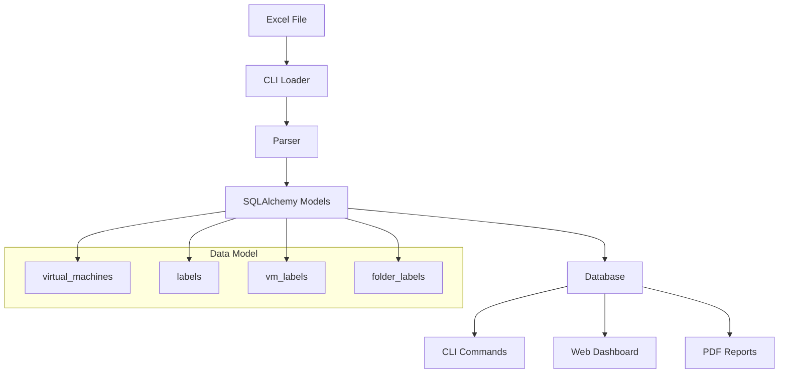

# VMware Inventory OPA

A Python CLI tool for managing VMware inventory data from Excel exports into a structured database.

## Features

### Core Functionality
- **📥 Excel Import**: Load VMware inventory data from Excel files
- **💾 Database Storage**: Store inventory in SQLite, PostgreSQL, or MySQL
- **⚡ CLI Interface**: Simple command-line interface for data management
- **📊 Statistics**: Query and analyze inventory data
- **🔍 Filtering**: Filter VMs by datacenter, cluster, and other attributes
- **🏷️ Label Management**: Organize VMs and folders with custom labels
- **💾 Backup & Restore**: Full database and label backup/restore capabilities
- **📈 Label Quality**: Comprehensive label coverage analysis and reporting

### Interactive Dashboard
- **🖥️ Web Interface**: Rich Streamlit-based dashboard with multiple views
- **📈 Advanced Analytics**: CPU vs Memory patterns, OS distribution, cluster efficiency
- **⚖️ Comparison Tools**: Side-by-side datacenter, cluster, and host comparisons
- **📁 Folder Analysis**: Comprehensive folder-level resource and storage analytics with label filtering
- **🔎 VM Explorer**: Advanced search with regex pattern matching and label filters
- **🔍 VM Search**: Dedicated regex-based search with advanced filters
- **🏷️ Folder Labelling**: Complete label management UI with inheritance and bulk operations
- **📊 Data Quality**: Field completeness analysis, recommendations, and label quality reporting
- **💾 Database Backup**: Dedicated backup/restore page with download capability
- **🚀 Migration Planning**: Multi-target migration planning with 6Rs framework, cost estimation, and duration modeling

### PDF Export
- **📄 Professional Reports**: Generate comprehensive PDF reports with 20+ visualizations
- **🎨 Multiple Formats**: Standard, Extended (all charts), or Summary (tables only)
- **⚙️ Customizable**: Configurable page size, chart quality (DPI), color schemes
- **📑 Rich Content**: Executive summaries, infrastructure analysis, resource metrics, storage efficiency

## Architecture



## Quick Start

```bash
# Install the package
pipx install inv-vmware-opa

# Load data from Excel
uv run python -m src.cli load inputs/vmware-inv.xlsx --clear

# View statistics
uv run python -m src.cli stats

# List VMs
uv run python -m src.cli list --limit 10
```

## Use Cases

- **Inventory Management**: Track and organize VMware infrastructure
- **Reporting**: Generate statistics and reports from inventory data
- **Analysis**: Query and filter VMs by various attributes
- **Migration Planning**: Analyze VM distributions and resource usage

## Documentation

- **[Data Model](data-model.md)** - Complete database schema and table reference
- **[CLI Commands](user-guide/cli-commands.md)** - Command-line interface guide
- **[Dashboard](user-guide/dashboard.md)** - Web interface documentation
- **[PDF Export](user-guide/pdf-export.md)** - Report generation guide
- **[Getting Started](getting-started/quickstart.md)** - Quick start guide

## Requirements

- Python 3.10 or higher
- SQLAlchemy 2.0+
- Click 8.0+
- Pandas 2.0+
- OpenPyXL 3.0+
- Streamlit 1.28+ (for dashboard)

## License

MIT License
